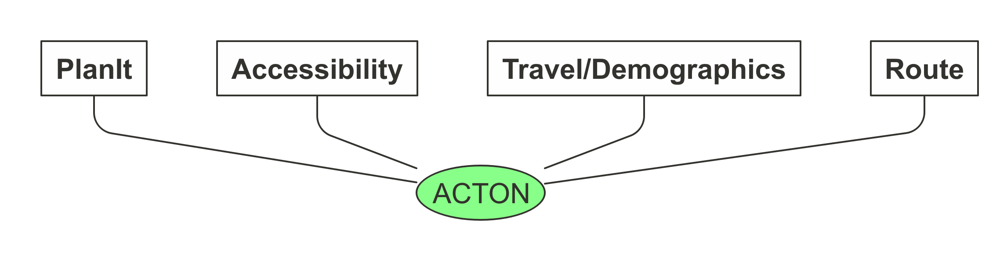

<!-- README.md is generated from README.Rmd. Please edit that file -->

## acton

<!-- badges: start -->

[](https://travis-ci.com/cyipt/acton)
[](https://circleci.com/gh/cyipt/acton)
<!-- badges: end -->

## Introduction

**ACTON** stands for active transport options for new developments.
ACTON a research project to provide evidence for local authorities,
developers and civil society groups to support planning and investment
in sustainable transport infrastructure in and around new developments.
To make the results of the research more reproducible and accessible to
others, it is also an R package.

In first place, ACTON is about evidence-based planning and that means it
is about data. ACTON provides easy access to actionable data from 4 main
sources, each of which is already in the public domain, which had never
before been made available in a single place or analysed together to
support planning, as illustrated in the schematic diagram below.

    #> QStandardPaths: XDG_RUNTIME_DIR not set, defaulting to '/tmp/runtime-robin'
    #> TypeError: Attempting to change the setter of an unconfigurable property.
    #> TypeError: Attempting to change the setter of an unconfigurable property.



The four main data sources shown above are:

  - PlanIt data on new developments based on planning documents
    submitted to local government planning departments
  - Accessibility data, including travel times by mode for different
    trip purposes, e.g. the average time taken to cycle to the shops,
    for small administrative zones (MSOA and LSOA level)
  - Route data from routing services such as CycleStreets.net, providing
    data on the transport network with variables such as busyness and
    speed limits along roads nearby new and planned development sites
  - Census data, providing demographic data and likely work destinations
    at the origin-destination level (plus data derived from the Census
    via the Propensity to Cycle Tool project)

ACTON seeks to make these datasets more widely accessible and actionable
by combining them and using them to assess walking and cycling provision
in and around new developments, to inform policies and investment

For more information about the research project, see the in-progress
[ACTON
report](https://cyipt.github.io/acton/articles/the-acton-project.html)
and [case
study](https://cyipt.github.io/acton/articles/case-studies.html)
articles.

## Installing the R package

To install the `acton` package, run the following commands in an R
console (see
[here](https://docs.ropensci.org/stats19/articles/stats19-training-setup.html)
for information on installing R):

``` r
install.packages("remotes")
remotes::install_github("cyipt/acton", dependencies = "Suggests")
```

## Setup instructions

To get routes from CycleStreets.net, you will need to set-up an API key
called CYCLESTREETS with `usethis::edit_r_environ()`, as documented
here:
<https://docs.ropensci.org/stplanr/reference/route_cyclestreets.html#details>

## Brief demo

The package can be used to get data on new developments as follows:

``` r
library(acton)
# data from specific postcode
planning_data = get_planit_data(pcode = "LS2 9JT", limit = 2)
#> Getting data from https://www.planit.org.uk/api/applics/geojson?limit=2&bbox=&end_date=2020-03-04&start_date=2000-02-01&pg_sz=2&pcode=LS2%209JT
planning_data
#> Simple feature collection with 2 features and 16 fields
#> geometry type:  POINT
#> dimension:      XY
#> bbox:           xmin: -1.55333 ymin: 53.80796 xmax: -1.55333 ymax: 53.80796
#> epsg (SRID):    4326
#> proj4string:    +proj=longlat +datum=WGS84 +no_defs
#> # A tibble: 2 x 17
#>   doc_type name  distance url   description when_updated        authority_id
#>   <chr>    <chr>    <dbl> <chr> <chr>       <dttm>                     <int>
#> 1 PlanApp… Leed…        0 http… Alteration… 2019-07-02 11:47:13          292
#> 2 PlanApp… Leed…        0 http… Listed Bui… 2018-08-14 09:53:45          292
#> # … with 10 more variables: source_url <chr>, authority_name <chr>, link <chr>,
#> #   postcode <chr>, address <chr>, lat <dbl>, lng <dbl>, start_date <date>,
#> #   uid <chr>, geometry <POINT [°]>
planning_data$name
#> [1] "Leeds/19/02996/FU" "Leeds/18/03877/LI"
planning_data$description
#> [1] "Alterations to carry out works to two public realm areas at university campus entrance"                                                                                                            
#> [2] "Listed Building application for partial demolition, external alterations and refurbishment of multiple levels of accommodation and associated improvements to existing teaching and research space"
```

## Documentation

For a more detailed overview explaining how to use the package see the
[`acton` vignette](https://cyipt.github.io/acton/articles/acton.html).

For results of research into active travel opportunities in and around
new developments in case study regions, see the [`case-studies`
vignette](https://cyipt.github.io/acton/articles/case-studies.html).

For documentation on each of the package’s functions, see the [Reference
page](https://cyipt.github.io/acton/reference/index.html).

## Citing the work

TBC.
